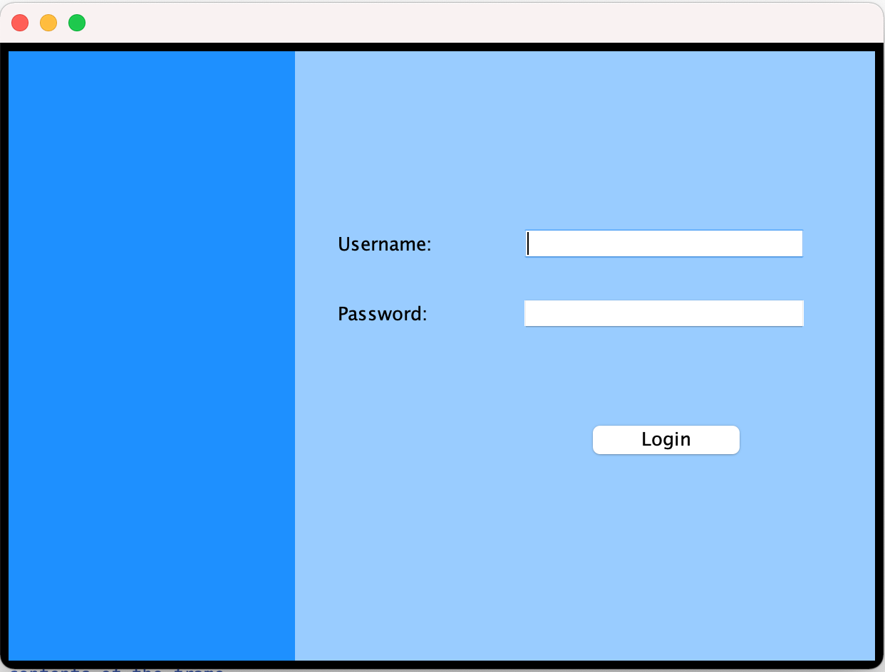
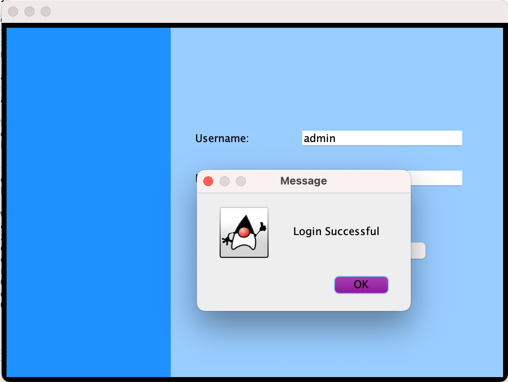
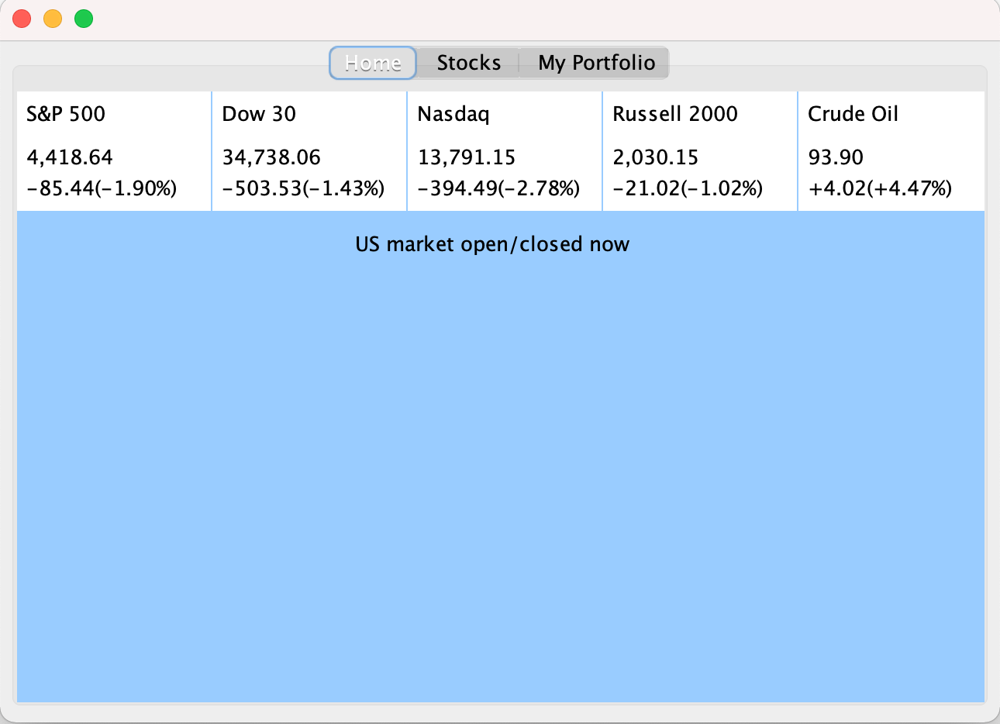
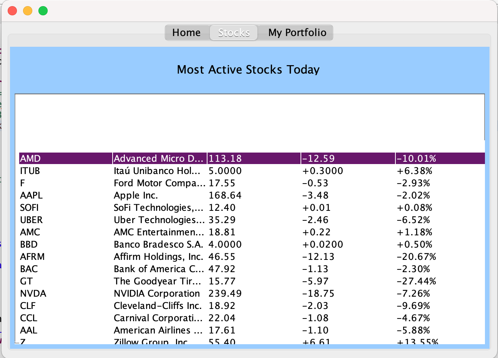

# Investment_management_app_Java
App developed on Eclipse IDE for Java developers for personal Investment management and tracking. 

#### Project is still in progress

## Current developments
- The app has a fully functioning login page. It is not yet connected to database 
- The stocks real-time pricing and information has been successfully web-scraped and displayed on Home and Stocks tabs
- I am using tabs view to work as a menu bar for better user experience 

  
   

  
   

### Further developments will include 
- Linking the project with MySQL database to make it account based and store portfolio information 
- Being able to add, delete stocks in My portfolio 
- Sending email notifications when the price for stock in portfolio is below specified value. 
- More ideas might be added on the go)
