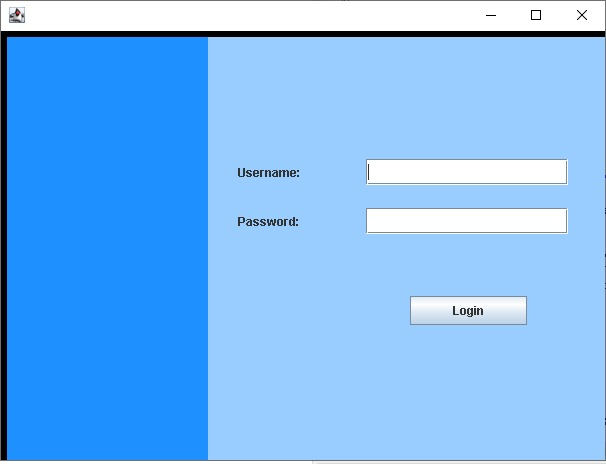
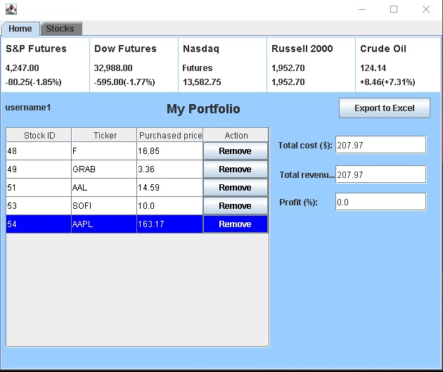
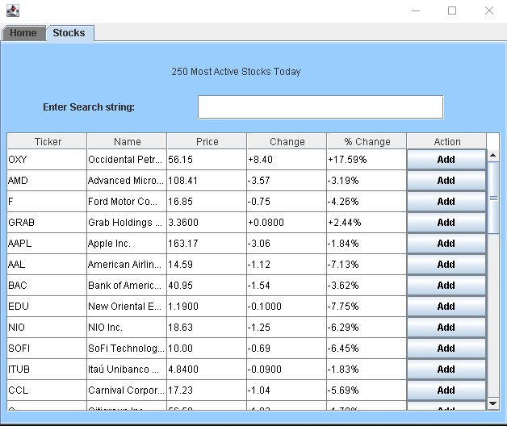
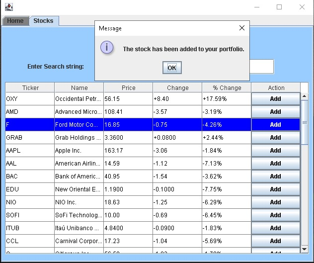
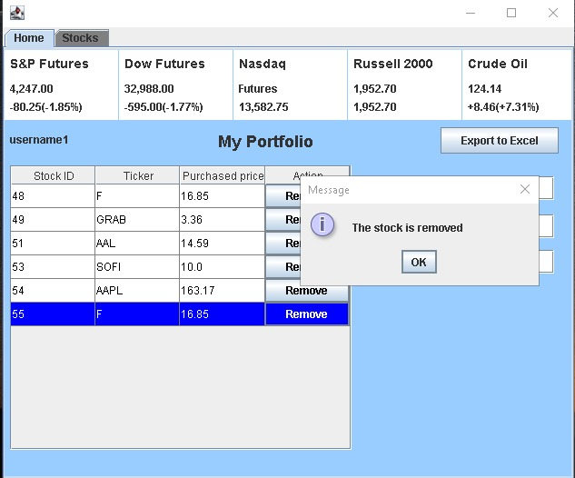

# Investment_management_app_Java
The puspose of the project is to assist non-professional individuals in monitoring their stocks and to help prevent losing much money on it. The app is developed in Eclipse IDE for Java devlopers. 

## Features of the app
- Java Database connection established in back-end.
- JavaMail API is used to send email notification through Gmail. 
- Java web-scraping is used to give the latest updated pricing of the active stocks. The data is retrieved from Yahoo Finance and populates the table in 'stocks' tab. 
- Search bar in 'stocks' tab can dynamically perform searching (no need to press any button).
- 'Add' button uploads the information to MySQL, which is then displayed on the 'My Portfolio' table.
- 'Remove' button removes the relevant stock from the database and removes from 'My Portfolio' table.
- Total cost is calculated by adding the price spent on 'buying' the stocks in portfolio. Uses data from MySQL (it doesnt update in real-time).
- Total revenue is the latest market price of the portfolio stocks (web-scraped).
- Login page which verifies the username and password with the database data.
- 'My portfolio' table displays only the stocks which belong to the logged user.

## Screenshots

  
   

  
   

  

### Further improvement ideas
- Add Registration page. 
- Replace web scraping data with something else e.g.external API. The app is too dependent on the code of the Yahoo Finance. 
